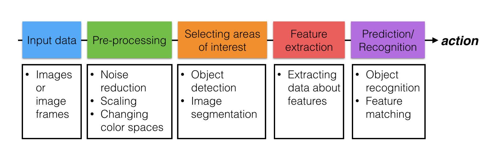

# Udacity - Artificial Intelligence Nanodegree

Cédric Campguilhem, 2020

## Projects

Project | Description                     | Link
--------|---------------------------------|------- 
01      | Deep learning: image classifier | [link](./02_Deep_Neural_Networks/P01_Image_Classifier/Image_Classifier_Project.ipynb)
02      | Computer Vision                 | [link](./06_Computer_Vision/P02_Facial_Keypoints_Detection/02_Define_network_architecture.ipynb) and [link](./06_Computer_Vision/P02_Facial_Keypoints_Detection/03_Facial_keypoint_detection.ipynb)
03      | Natural Language Processing     | [link](./07_Natural_Language_Processing/P03_Part_of_speech_tagging/HMM_Tagger.ipynb)


## Artificial Intelligence ressources

[Artificial Intelligence: A Modern Approach](http://aima.cs.berkeley.edu/).

## Data Engineering

### ETL pipeline

#### pandas

You can access specific method of datetime objects in pandas dataframe by 
using `df[column].dt.???`

The following code collects all the encodings available on the system:

```python
from encodings.aliases import aliases
alias_values = set(aliases.values())
```

Then, you can use:

```python
import pandas as pd
pd.read_csv(filename, encoding=alias)
```

Or, you can use [chardet](https://pypi.org/project/chardet/) library:

```python
# import the chardet library
import chardet 

# use the detect method to find the encoding
# 'rb' means read in the file as binary
with open("mystery.csv", 'rb') as file:
    print(chardet.detect(file.read()))
```

Pandas provide a method [get_dummies](https://pandas.pydata.org/pandas-docs/stable/reference/api/pandas.get_dummies.html) to do one-hot encoding:

```
>>> pd.get_dummies(pd.Series(list('abcaa')), drop_first=True)
   b  c
0  0  0
1  1  0
2  0  1
3  0  0
4  0  0
```

#### scikit-learn

Here is documentation on outlier processing with [sklearn](https://scikit-learn.org/stable/modules/outlier_detection.html).
The following explanation [here](https://towardsdatascience.com/a-brief-overview-of-outlier-detection-techniques-1e0b2c19e561) is also very thorough.
Also look [here](https://en.wikipedia.org/wiki/Outlier#Tukey's_fences) for Tukey's fences method.

#### Other libraries

Library [pycountry](https://pypi.org/project/pycountry/) provides standards 
for countries.

A tutorial for the use of [Regular Expressions](https://medium.com/factory-mind/regex-tutorial-a-simple-cheatsheet-by-examples-649dc1c3f285).

### NLP Pipelines

#### Word embedding techniques

[Word2Vec](https://www.youtube.com/watch?time_continue=9&v=7jjappzGRe0&feature=emb_logo)

[GloVe](https://www.youtube.com/watch?v=KK3PMIiIn8o&feature=emb_logo)

[Uses](https://www.youtube.com/watch?time_continue=2&v=gj8u1KG0H2w&feature=emb_logo) in Deep Learning.

Visualization of word embedding with [t-SNE](https://www.youtube.com/watch?v=xxcK8oZ6_WE&feature=emb_logo)

### Machine Learning Pipelines

You can implement your own Estimator, Classifier or Transformer with 
[Scikit-Learn](https://scikit-learn.org/stable/developers/develop.html?highlight=custom%20transformer)

There is also a [class](https://scikit-learn.org/stable/modules/generated/sklearn.preprocessing.FunctionTransformer.html#sklearn.preprocessing.FunctionTransformer) to create a transformer from an existing function.

## Deep Learning: Neural Networks

### Udacity GitHub repos

https://github.com/udacity/DSND_Term1


### Gradient Descent

Using [momentum](https://distill.pub/2017/momentum/) with gradient descent to avoid falling into local minimum.

[Optimization algorithms](https://ruder.io/optimizing-gradient-descent/index.html#rmsprop)

An [overview](https://ruder.io/optimizing-gradient-descent/index.html) of gradient descent algorithms.

### Backpropagation algorithm

Backpropagation algorithm explained [here](https://medium.com/@karpathy/yes-you-should-understand-backprop-e2f06eab496b#.vt3ax2kg9) and [there](https://www.youtube.com/watch?v=59Hbtz7XgjM) by Andrej Karpathy.

### PyTorch

PyTorch [installation](https://pytorch.org/get-started/locally/).

PyTorch API [documentation](https://pytorch.org/docs/stable/torch.html).

PyTorch [tutorial](https://github.com/yunjey/pytorch-tutorial).

### Keras

[Optimizers](https://keras.io/optimizers/)

Training [progress](https://www.machinecurve.com/index.php/2019/10/08/how-to-visualize-the-training-process-in-keras/) with Keras.

### TensorFlow

How to install with [conda](https://towardsdatascience.com/tensorflow-gpu-installation-made-easy-use-conda-instead-of-pip-52e5249374bc).

[Migrating](https://www.tensorflow.org/guide/migrate) TensorFlow 1.x to 2.x. Which is a pain in the neck, the better option is to start working with TensorFlow 2.x using tf.keras instead of Keras alone. Check [here](https://www.pyimagesearch.com/2019/10/21/keras-vs-tf-keras-whats-the-difference-in-tensorflow-2-0/) for more information.

Official [tutorials](https://www.tensorflow.org/tutorials).

[Custom](https://towardsdatascience.com/custom-loss-function-in-tensorflow-2-0-d8fa35405e4e) loss function.

YouTube tutorial by [freeCodeCamp.org](https://www.youtube.com/watch?v=tPYj3fFJGjk).

### CUDA

We can use the `nvidia-smi` command to monitor the GPU usage.

To [de-activate](https://datascience.stackexchange.com/questions/58845/how-to-disable-gpu-with-tensorflow) CUDA to avoid GPU processing.

### Loss functions

When to use [cross-entropy](https://peltarion.com/knowledge-center/documentation/modeling-view/build-an-ai-model/loss-functions/categorical-crossentropy).

[Cross-entropy](https://en.wikipedia.org/wiki/Cross_entropy) function.

### Convolutional Neuron Networks

[Object detection](https://lilianweng.github.io/lil-log/2017/12/31/object-recognition-for-dummies-part-3.html).

[Semantic segmentation](http://blog.qure.ai/notes/semantic-segmentation-deep-learning-review).

[Image captioning](https://github.com/yunjey/pytorch-tutorial/tree/master/tutorials/03-advanced/image_captioning).

## Constraint Satisfaction Problems

A [blog post](http://norvig.com/sudoku.html) by Peter Norvig to solve Sudoku.

A [paper](https://storage.googleapis.com/deepmind-media/alphago/AlphaGoNaturePaper.pdf) on Deep Neural Network combined with tree search for Alpha Go algorithm.

A lecture on [topological search](https://courses.cs.washington.edu/courses/cse326/03wi/lectures/RaoLect20.pdf).

The [Z3](https://github.com/Z3Prover/z3/wiki#background) library for solving CSP's.

[Graph coloring](https://en.wikipedia.org/wiki/Graph_coloring).

[Google OR Tools](https://developers.google.com/optimization/introduction/overview) documentation for CS problems.

A [book](https://yurichev.com/writings/SAT_SMT_by_example.pdf) with a lot of examples of problem resolutions.

A [survey](https://hal.archives-ouvertes.fr/hal-01230685) on tractability.

A [paper](https://www.cs.cornell.edu/gomes/papers/satsolvers-kr-handbook.pdf) on satisfiability solvers.

A [paper](http://www.optimization-online.org/DB_FILE/2012/02/3378.pdf) on non-convex mixed-integer non-linear problems.

A [paper](https://www.andrew.cmu.edu/user/vanhoeve/papers/alldiff.pdf) on AllDifferent constraint.

## Probabilistic models

### Bayes Networks

[PyMC3](https://docs.pymc.io/notebooks/bayesian_neural_network_advi.html) library for probabilistic models.

[Sentiment classification](https://web.stanford.edu/~jurafsky/slp3/4.pdf) using Naive Bayes (also available here /files/cedric/personnel/informatique/ebooks/Probabilistic Models/naive_bayes_sentiment_analysis.pdf).

### Dynamic Time Wrapping

An [article](http://wearables.cc.gatech.edu/paper_of_week/DTW_myths.pdf) on Dynamic Time wrapping (also available here: /files/cedric/personnel/informatique/ebooks/Probabilistic Models/dynamic_time_warping_myths.pdf).

### Hidden Markov Model

The handbook of [HTK](http://speech.ee.ntu.edu.tw/homework/DSP_HW2-1/htkbook.pdf), the Hidden Markov Model toolkit (also available here /files/cedric/personnel/informatique/ebooks/Probabilistic Models/htkbook_hidden_markov_toolkit.pdf).

The online documentation is also [there](http://htk.eng.cam.ac.uk/download.shtml).

### Recurrent Networks

As an alternative to Hidden Markov Model, here is a recurrent network for [sequence analysis](https://web.stanford.edu/~jurafsky/slp3/9.pdf) (also available here /files/cedric/personnel/informatique/ebooks/Probabilistic Models/sequence_processing_with_recurent_network.pdf).

## Computer Vision

### Image representation and classification



A reminder on [gradient descent algorithm](https://en.wikipedia.org/wiki/Gradient_descent).

An intuitive [introduction](https://ujjwalkarn.me/2016/08/11/intuitive-explanation-convnets/) to convolutional neuron network.

OpenCV [website](https://opencv.org/) and [tutorials](https://opencv-python-tutroals.readthedocs.io/en/latest/index.html).

Changing colorspaces with [OpenCV](https://opencv-python-tutroals.readthedocs.io/en/latest/py_tutorials/py_imgproc/py_colorspaces/py_colorspaces.html).

Colors on [W3Schools.com](https://www.w3schools.com/colors/default.asp).

[AMOS](http://mvrl.cs.uky.edu/datasets/amos/) dataset used for day/night image classification.

### Convolutional filters and edge detection

[Fourier transform](https://docs.opencv.org/3.0-beta/doc/py_tutorials/py_imgproc/py_transforms/py_fourier_transform/py_fourier_transform.html) with OpenCV: high-pass filter for edge detection.

[Smoothing](https://opencv-python-tutroals.readthedocs.io/en/latest/py_tutorials/py_imgproc/py_filtering/py_filtering.html) images using filters in OpenCV.

[Gaussian blur](https://en.wikipedia.org/wiki/Gaussian_blur) on Wikipedia.

[Canny edge detection](https://opencv-python-tutroals.readthedocs.io/en/latest/py_tutorials/py_imgproc/py_canny/py_canny.html) algorithm.

An explanation of the [Hough transform](http://homepages.inf.ed.ac.uk/rbf/HIPR2/hough.htm).

How to apply [Hough transform](https://opencv-python-tutroals.readthedocs.io/en/latest/py_tutorials/py_imgproc/py_houghlines/py_houghlines.html) with OpenCV.

[Identifying road lanes](https://towardsdatascience.com/teaching-cars-to-see-advanced-lane-detection-using-computer-vision-87a01de0424f) for self-driving cars.

[Joy Buolamwini](https://www.media.mit.edu/people/joyab/overview/) fighting agianst bias in algorithms, [gender shades](http://gendershades.org/index.html) bias, and her [TED talk](https://www.ted.com/talks/joy_buolamwini_how_i_m_fighting_bias_in_algorithms) and [article](https://video.udacity-data.com/topher/2018/June/5b2c01ba_gender-shades-paper/gender-shades-paper.pdf).

[Fairness](https://godatadriven.com/blog/fairness-in-machine-learning-with-pytorch/) in machine learning with PyTorch.

[Delayed impact of fair machine learning](https://bair.berkeley.edu/blog/2018/05/17/delayed-impact/) from Berkeley Airtificial Intelligence Research (BAIR).

[Can we keep our biases from creeping into AI?](https://hbr.org/2018/02/can-we-keep-our-biases-from-creeping-into-ai?utm_campaign=hbr&utm_source=twitter&utm_medium=social) in Harvard Business Review.

### Types of features and image segmentation

[Harris corner detection](https://opencv-python-tutroals.readthedocs.io/en/latest/py_tutorials/py_feature2d/py_features_harris/py_features_harris.html) with OpenCV.

[Contour detection](https://opencv-python-tutroals.readthedocs.io/en/latest/py_tutorials/py_imgproc/py_contours/py_table_of_contents_contours/py_table_of_contents_contours.html) with OpenCV.

[K-Means clustering](https://docs.opencv.org/3.0-beta/doc/py_tutorials/py_ml/py_kmeans/py_kmeans_opencv/py_kmeans_opencv.html) with OpenCV.

### Features vectors

Histograms of Oriented Gradients (HOG) in [OpenCV](https://opencv-python-tutroals.readthedocs.io/en/latest/py_tutorials/py_imgproc/py_histograms/py_table_of_contents_histograms/py_table_of_contents_histograms.html).

### CNN and Features Visualization

An introduction to [CNN](https://cezannec.github.io/Convolutional_Neural_Networks/).

[PyTorch vs TensorFlow](https://towardsdatascience.com/pytorch-vs-tensorflow-1-month-summary-35d138590f9).

The [fashion-mnist](https://github.com/zalandoresearch/fashion-mnist) dataset.

[Pooling](https://pytorch.org/docs/stable/nn.html#pooling-layers) layers in Pytorch.

Visualization of neural net with [deconvolution](https://arxiv.org/pdf/1412.6806.pdf).

[Visualizing and understanding](https://video.udacity-data.com/topher/2018/April/5adf876c_visualizing-conv-nets/visualizing-conv-nets.pdf) convolutional neuron networks, also [here](https://cs.nyu.edu/~fergus/papers/zeilerECCV2014.pdf) and this [Youtube](https://www.youtube.com/watch?v=ghEmQSxT6tw) video.

[What NN see](https://experiments.withgoogle.com/what-neural-nets-see) explaining video.

[Batch normalization](https://towardsdatascience.com/batch-normalization-in-neural-networks-1ac91516821c) article in Towards Data Science.

[AlexNet](https://medium.com/@smallfishbigsea/a-walk-through-of-alexnet-6cbd137a5637) architecture explained.

A must-read [article](https://towardsdatascience.com/how-to-visualize-convolutional-features-in-40-lines-of-code-70b7d87b0030) to make feature visualization.

## Natural Language Processing

### Tools and libraries

Working with text data with [pandas](https://pandas.pydata.org/pandas-docs/stable/user_guide/text.html).

The regular expression module of [python](https://docs.python.org/3/library/re.html).

Documentation to use [BeautifulSoup](https://www.crummy.com/software/BeautifulSoup/bs4/doc/).

NLTK documenation for the [tokenizer](http://www.nltk.org/api/nltk.tokenize.html) package.

[pomegranate](https://github.com/jmschrei/pomegranate) library for Hidden Markov Models (among many others...). And the documentation [here](https://pomegranate.readthedocs.io/en/latest/HiddenMarkovModel.html#initialization).

### Other materials

Sequence processing with recurrent networks [article](https://web.stanford.edu/~jurafsky/slp3/9.pdf).

Encoder-Decoder Models, Attention, and Contextual Embeddings [article](https://web.stanford.edu/~jurafsky/slp3/10.pdf).

New aggregator dataset on [UCI machine learning repository](https://archive.ics.uci.edu/ml/datasets/News+Aggregator).

Universal part-of-speedch tagging [article](http://www.petrovi.de/data/universal.pdf).

The API use of [quotes](http://quotes.rest/) to get famous quotes.

## Search, Optimization and Planning

### Search algorithms

A mini-project that I have implemented during the lesson: http://ai.berkeley.edu/project_overview.html. The source code of what I did [here]([link](./08_Search_Optimization_and_Planning01_Search_Project_PacMan). The projet makes use of Deep-First Search, Breadth-First Search, Uniform-Cost Search and A* algorithms.

Other algorithm for search: https://www.ise.bgu.ac.il/faculty/felner/papers/2011/socs/dikstra.pdf.

A [variant](http://theory.stanford.edu/~amitp/GameProgramming/Variations.html) to A*.

An alternative to A*: [Jump Point search](https://en.wikipedia.org/wiki/Jump_point_search).


